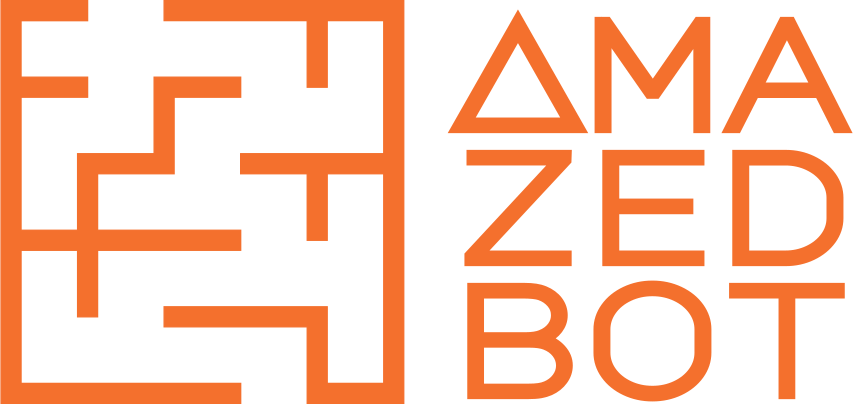

# AMazedBot Website &nbsp;    

 

Aplicación web creada para comunicar avances y presentar documentación de nuestro proyecto AMazedBot, para la clase de Laboratorio STEAM - TA2 en el Instituto Tecnológico de Informática, 2024.

## Como correr este proyecto

Requisitos:

- Bun.sh (Instalar la última versión desde [https://bun.sh/](https://bun.sh/))
- git

Ahora en tu terminal favorita escribe lo siguiente:

	git clone -b site git@github.com:GLPG35/AMazedBot.git
	cd AMazedBot
	bun install

Eso debería instalar todas las dependencias necesarias para el proyecto

Una vez todo esté instalado tienes dos opciones:

- Correr en modo desarrollo:
		
		bun dev

- Crear una build del proyecto y ver la vista previa:

		bun start

## Links

- [Sitio Web](https://amazedbot.vercel.app/)

## Librerías

Este proyecto usa algunas librerías para funcionar:

- [React](https://github.com/facebook/react)
- [Framer Motion](https://github.com/framer/motion)
- [React Icons](https://github.com/react-icons/react-icons)
- [React Router](https://github.com/remix-run/react-router)
- [React Router Hash Link](https://github.com/rafgraph/react-router-hash-link)

## Licencia

Este proyecto está licenciado bajo los términos de la licencia MIT.
